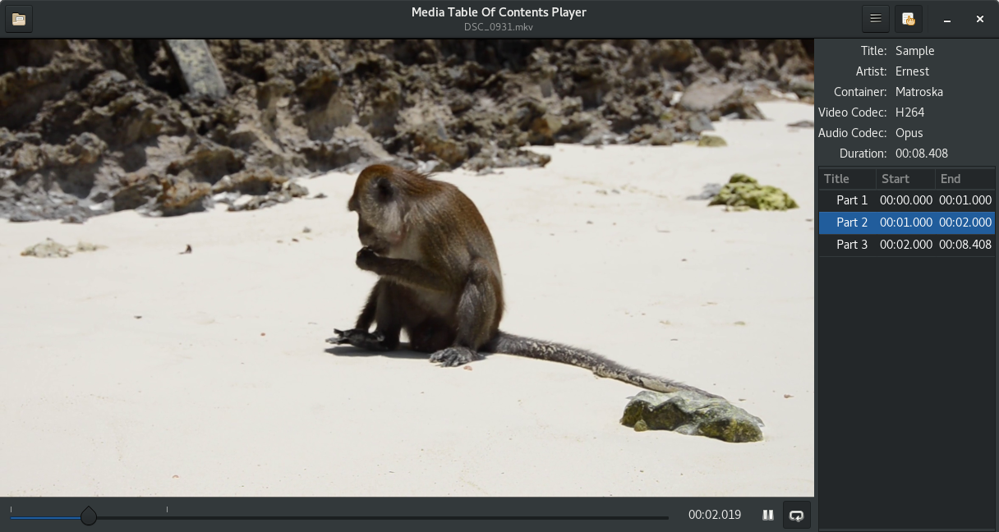

# media-toc
media-toc-player is a media player with a table of contents which allows seeking
to a given chapter. It is a simplication of [media-toc](https://github.com/fengalin/media-toc),
an application to create and edit a table of contents from a media file. It is
primarily developed in Rust on Linux, it can be built on Windows and should also
work on macOS.

## <a name='ui'></a>Screenshots


# Todo
I intend to keep this application simple. These are the modifications that I
forsee:
- Allow hiding the chapter's list.
- Switch to full screen mode.
- Loop on the selected chapter.
- Display the cover image on the left for audio files.

# Technologies
**media-toc** is developed in Rust and uses the following technologies:
- **GTK-3** ([official documentation](https://developer.gnome.org/gtk3/stable/),
[Rust binding](http://gtk-rs.org/docs/gtk/)) and [Glade](https://glade.gnome.org/).
- **Cairo** ([official documentation](https://www.cairographics.org/documentation/),
[Rust binding](http://gtk-rs.org/docs/cairo/index.html)).
- **GStreamer** ([official documentation](https://gstreamer.freedesktop.org/documentation/),
[Rust binding](https://github.com/sdroege/gstreamer-rs)).

# Environment preparation
## Toolchain
Rust nightly version is required at the moment.
```
$ curl https://sh.rustup.rs -sSf | sh
```
Select the nightly toolchain. See the full documentation
[here](https://github.com/rust-lang-nursery/rustup.rs#installation).

## Dependencies
Rust dependencies are handled by [Cargo](http://doc.crates.io/). You will also
need the following packages installed on your OS:

### Fedora
```
sudo dnf install gtk3-devel glib2-devel gstreamer1-devel gstreamer1-plugins-base-devel gstreamer1-plugins-good gstreamer1-plugins-bad-free-gtk
```

### Debian & Unbuntu
```
sudo apt-get install libgtk-3-dev libgstreamer1.0-dev libgstreamer-plugins-base1.0-dev gstreamer1.0-plugins-good gstreamer1.0-plugins-bad
```

### MacOS
*Needs confirmation*
```
brew install gtk+3 gstreamer-1.0-devel gstreamer-1.0-plugins-good gstreamer-1.0-plugins-bad
```

### Windows
- MSYS2: follow [this guide](http://www.msys2.org/).
- Install the development toolchain, GTK and GStreamer<br>
Note: for a 32bits system, use `mingw-w64-i686-...`
```
pacman -S mingw-w64-x86_64-toolchain base-devel mingw-w64-x86_64-gtk3 \
    mingw-w64-x86_64-gstreamer mingw-w64-x86_64-gst-plugins-base
```
For the execution, you will also need (opencv seems necessary to play a video,
anyone knows which package can pull it?):
```
pacman -S mingw-w64-x86_64-gst-plugins-good mingw-w64-x86_64-gst-plugins-bad \
    mingw-w64-x86_64-gst-plugins-ugly
```

- Launch the [rustup installer](https://www.rustup.rs/).
When asked for the default host triple, select `x86_64-pc-windows-gnu` (or
`i686-pc-windows-gnu` for a 32bits system), then select `nightly`.
- From a MSYS2 shell
  - add cargo to the `PATH`:
  ```
  echo 'PATH=$PATH:/c/Users/'$USER'/.cargo/bin' >> .bashrc
  ```
  - Restart the MSYS2 shell before using `cargo`.

# Build and run
Use Cargo (from the root of the project directory):
```
$ cargo run --release
```
