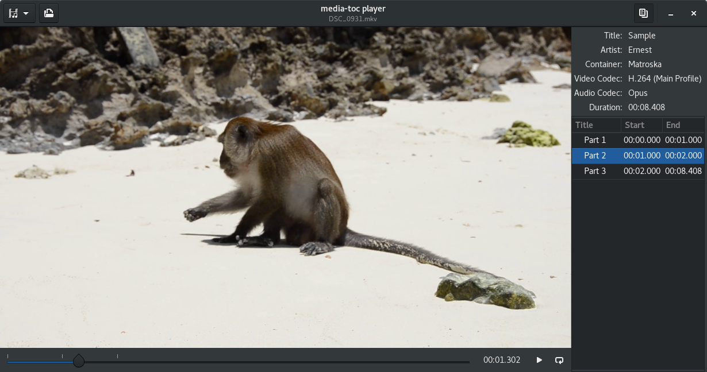

# media-toc-player [](https://travis-ci.org/fengalin/media-toc-player) [](https://ci.appveyor.com/project/fengalin/media-toc-player)
**media-toc-player** is a media player with a table of contents which allows seeking
to a given chapter and optionally looping on current chapter.

**media-toc-player** is a simplication of [media-toc](https://github.com/fengalin/media-toc),
an application to create and edit a table of contents from a media file. It is
primarily developed in Rust on Linux, it runs on Windows and should also work on macOS.

## <a name='ui'></a>Screenshot


# Features
- Play any media supported by the installed GStreamer plugins.
- Select the video / audio stream to play.
- Show the chapters list for the media.
- Move to a chapter by clicking on its entry the list.
- Loop on current chapter.

# Todo
- Switch to full screen mode.
- Display subtitles.
- Make timeline foldable.
- Finalize flatpak and deal with potential license issues with plugins.

# Technologies
**media-toc-player** is developed in Rust and uses the following technologies:
- **GTK-3** ([official documentation](https://developer.gnome.org/gtk3/stable/),
[Rust binding](http://gtk-rs.org/docs/gtk/)) and [Glade](https://glade.gnome.org/).
- **GStreamer** ([official documentation](https://gstreamer.freedesktop.org/documentation/),
[Rust binding](https://sdroege.github.io/rustdoc/gstreamer/gstreamer/)).

# Environment preparation
## Toolchain
```
$ curl https://sh.rustup.rs -sSf | sh
```
Select the stable toolchain. See the full documentation
[here](https://github.com/rust-lang-nursery/rustup.rs#installation).

## Dependencies
Rust dependencies are handled by [Cargo](http://doc.crates.io/). You will also
need the following packages installed on your OS:

### Fedora
```
sudo dnf install gtk3-devel glib2-devel gstreamer1-devel \
	gstreamer1-plugins-base-devel gstreamer1-plugins-{good,bad-free,ugly-free} \
	gstreamer1-libav
```

### Debian & Unbuntu
```
sudo apt-get install libgtk-3-dev libgstreamer1.0-dev \
	libgstreamer-plugins-base1.0-dev gstreamer1.0-plugins-{good,bad,ugly} \
	gstreamer1.0-libav
```

### macOS
*Needs confirmation*
```
brew install gtk+3 gstreamer gst-plugins-{base,good,bad,ugly} gst-libav
```

### Windows
- MSYS2: follow [this guide](http://www.msys2.org/).
- Install the development toolchain, GTK and GStreamer<br>
Note: for a 32bits system, use `mingw-w64-i686-...`
```
pacman --noconfirm -S gettext-devel mingw-w64-x86_64-gtk3 mingw-w64-x86_64-gstreamer \
	mingw-w64-x86_64-gst-plugins-{base,good,bad,ugly} mingw-w64-x86_64-gst-libav
```

- Launch the [rustup installer](https://www.rustup.rs/).
When asked for the default host triple, select `x86_64-pc-windows-gnu` (or
`i686-pc-windows-gnu` for a 32bits system), then select `stable`.
- From a MSYS2 mingw shell
  - add cargo to the `PATH`:
  ```
  echo 'PATH=$PATH:/c/Users/'$USER'/.cargo/bin' >> /home/$USER/.bashrc
  ```
  - Restart the MSYS2 shell before using `cargo`.

# Build and run
Use Cargo (from the root of the project directory):
```
$ cargo run --release
```
